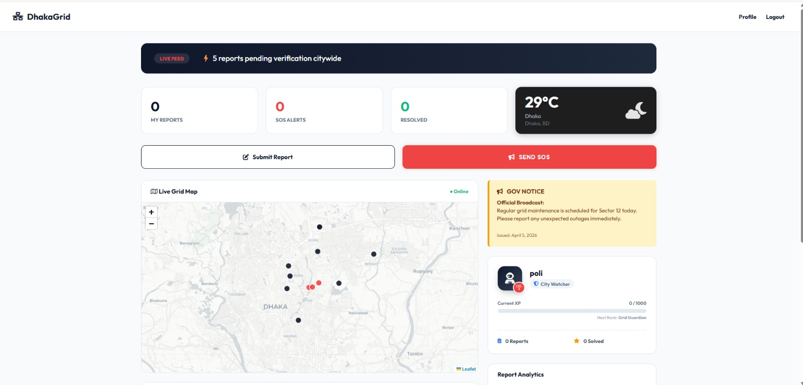
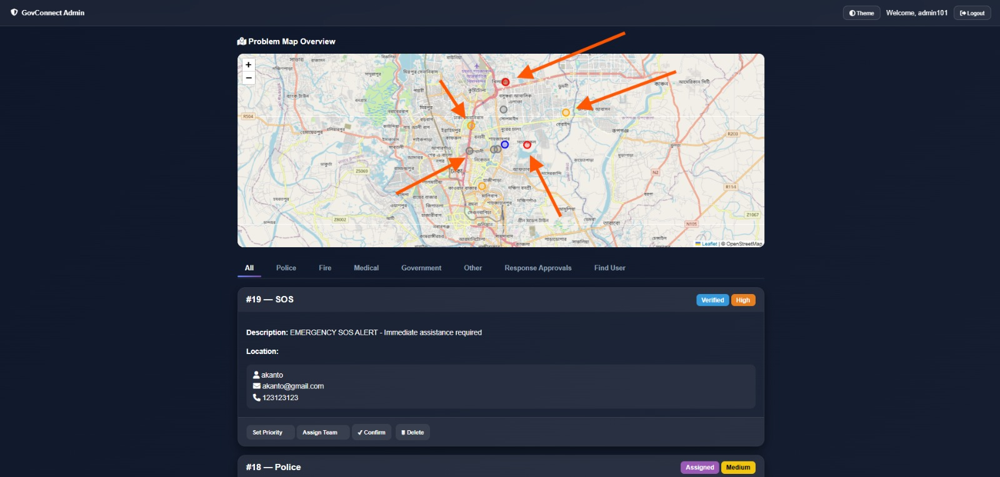
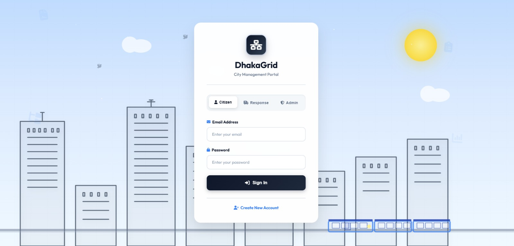
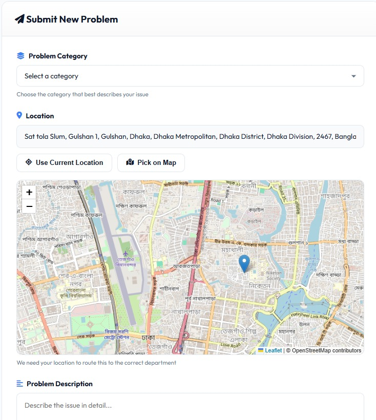

# 🏙️ DhakaGrid (formerly GovConnect)

**A high-performance City Management & Emergency Response Ecosystem.**

DhakaGrid is a full-stack web application designed to bridge the communication gap between citizens and emergency services. Originally conceived as *GovConnect*, the project has evolved into a modern, gamified portal where citizens can report crises, use one-click SOS features, and track city-wide incidents via real-time geospatial data.

---

## 🚀 The Core Experience

### 📍 Intelligent Geospatial Reporting
* **Leaflet JS Integration:** Real-time interactive mapping for incident localized reporting.
* **Map-to-Address Logic:** Users can set their profile address or report incident locations simply by clicking a point on the map—automatically fetching precise coordinates.
* **Visual Evidence:** Support for multimedia uploads (photos/documents) during problem submission to provide responders with immediate context.

### 🚨 Emergency SOS System
* **Flash Response:** A dedicated, high-priority SOS button that bypasses standard forms for instant department notification.
* **Live Grid Map:** A centralized "Live Feed" showing pending city-wide reports and SOS alerts.

### 🎮 Citizen Engagement (Gamification)
* **XP & Ranking System:** Citizens earn experience points (XP) for verified reports, progressing from a "City Watcher" to a "Grid Guardian."
* **Official Broadcasts:** A "Gov Notice" system for real-time city-wide announcements (e.g., maintenance outages).

---

## 👥 Tri-Role Management System

| Role | Capabilities | Primary Interface |
| :--- | :--- | :--- |
| **Citizen** | SOS triggering, Map-based reporting, Photo uploads, Profile mapping, XP tracking. | DhakaGrid User Portal |
| **Response Team** | View department-specific tickets (Fire, Police, Medical), access GPS coordinates, update resolution status. | Responder Dashboard |
| **Admin** | Full system moderation, data analytics, **Penalty Issuance**, and **Lifetime User Bans**. | GovConnect Admin Console |

---

## 🛠️ Tech Stack

| Layer | Technology |
| :--- | :--- |
| **Backend** |   |
| **Frontend** |   |
| **Mapping** |  |
| **Moderation** | Custom Logic for Penalties, Data Logging, and Account Suspension. |

---

## 📸 Interface Preview

### Modernized Login & Role Selection
> [!TIP]
> The login interface now supports tab-based role switching for a seamless UX between Citizens, Responders, and Admins.

| User Dashboard (DhakaGrid) | Admin Control Center |
| :---: | :---: |
|  |  |

---
| Login (DhakaGrid) | Problem Report Option |
| :---: | :---: |
|  |  |

---

## 🛡️ Moderation & System Integrity

DhakaGrid is built with **Accountability** at its core. To prevent system misuse:
* **Data Persistence:** Every report and SOS trigger is logged with a timestamp and user ID.
* **Penalty Logic:** Admins can flag specific users for "False Reporting."
* **Moderation Console:** Includes the ability to issue **Life-time Bans**, blocking the user's credentials from accessing the Grid entirely.

---

## ⚙️ Setup Instructions

1.  **Database:** Import `dhakagrid.sql` (or `gov_connect.sql`) into your MySQL server.
2.  **Configuration:** Update the `db_connection.php` file with your local database credentials.
3.  **Map Access:** Ensure an active internet connection to load the **Leaflet JS** tiles and OpenStreetMap data.

---
**Developed with 🏙️ by [Injabin](https://github.com/Injabin)**